# Git

首先，我不是前端小白，一名数学系的在校生，把自己的笔记分享下，希望对各位有用，欢迎提问!

下面有学习任务和一些git命令。

## 学习目标：

能说明版本控制系统的作用

能说明为什么选择学习Git

能说明命令行及使用常见命令

能说明工作区、暂存区和本地仓库以及远程仓库的概念

能使用github创建远端仓库

能完成基本的代码版本管理

## 知识点一：版本控制系统

### 为什么要使用版本控制系统

1. **协同开发**

   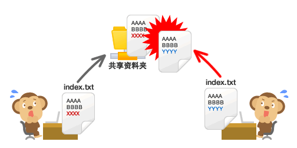

2. **版本存储**

   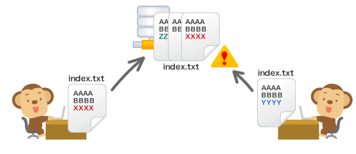

3. **回复之前的版本**

   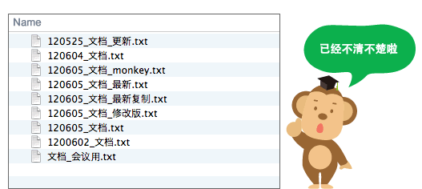

4. **了解发生了什么**

   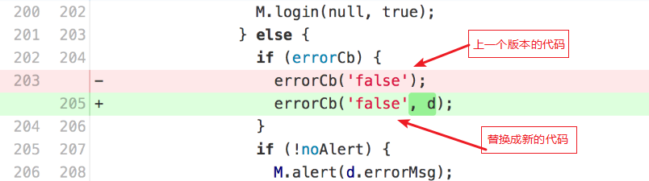

5. **备份**

    如果有的东西 因为意外 损坏了  可以通过版本控制系统 恢复

### 版本控制系统有哪些

**svn**(集中式版本控制系统)


**git**(分布式版本控制系统)


## 知识点二：Git介绍

### 为什么选择 Git？

#### 1.1 选择 Git 的理由

* 是当今**最流行**的版本控制系统，国内非常多的开发团队都在使用。

#### 1.2 创世人 —— 林纳斯


* **21 岁**开发出 Linux 第 1 个内核雏形，并立即开源；
* **36 岁**为管理 Linux 内核的开发，用**两周时间**开发出 Git 雏形，并立即开源。

> 提示：后续我们学习到的很多框架都是开源的 —— 大牛开发工具，我们使用工具，站在巨人肩膀上编程。

### Git是什么

Git是一个非常流行的分布式版本控制系统

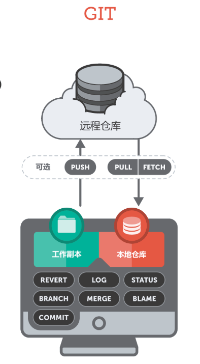

**优点：**

1. Git 运行快速(c语言写 linus大神写的专门用来管理linux系统的)
2. 离线工作(git不用联网 也能做版本管理  但是SVN绝对不行)
3. 可靠性高(svn有中央服务器  Git没有  即使中央服务器挂了 也能用)

## 知识点三：Git安装

### Git安装(提倡安装到C盘)

    > Git 检测

        ```
            git --version
        ```

### Git设置

   为什么要设置名字和邮箱呢？

    就是为了记录哪个人干了什么事

   怎么配置 
​    

```shell
$ git config --global user.name "你的名字"
$ git config --global user.email "你的邮箱"
```


## 知识点四：命令行工具及命令

    Git一共有两种方式来操作: 命令行  图形界面(GUI) 

    世界上开发工具有很多  自带的Git的图形界面也有很多  你学的完吗？ 

    但是不管有多少中 图形界面 底层的命令 完全一致 

### 常见命令行工具

**DOS命令行**

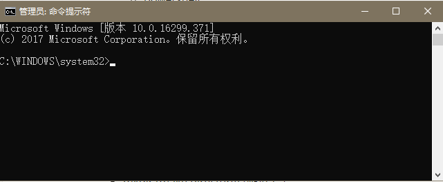

**Windows PowerShell**

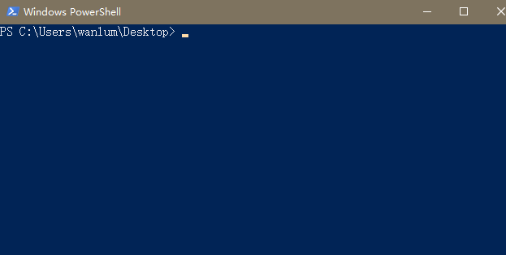

**git bash**（主要）

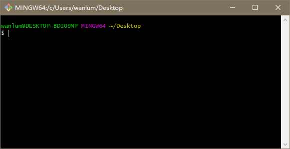


### 常用Linux命令


| 命令                                   | 含义                           |
| ------------------------------------ | ---------------------------- |
| pwd                                  | 返回给你当前你所位于的本地文件夹的路径          |
| cd ../                               | 向上移动一个目录                     |
| ls -la                               | 列表格式输出目录下所有文件包含隐藏文件          |
| rm path/file                         | 删除一个文件                       |
| rm -r path/folder                    | 删除一个文件夹                      |
| mv  oldpath newpath                  | 移动一个文件                       |
| mv old-filename.txt new-filename.txt | 文件进行重命名                      |
| mkdir foldername                     | 创建一个目录                       |
| TAB 键                                | 自动地把你的输入补全                   |
| 方向键                                  | 用键盘上的向上键，你可以一个一个地调出你刚刚使用过的命令 |
| touch                                | 创建一个文件（我自己 用的vi 文件名称.扩展名）    |


## 知识点五：如何创建远程仓库

### 第一步: 注册GItHub账号 并找到如下按钮

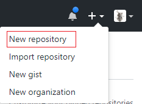

### 第二步：填写仓库的表单

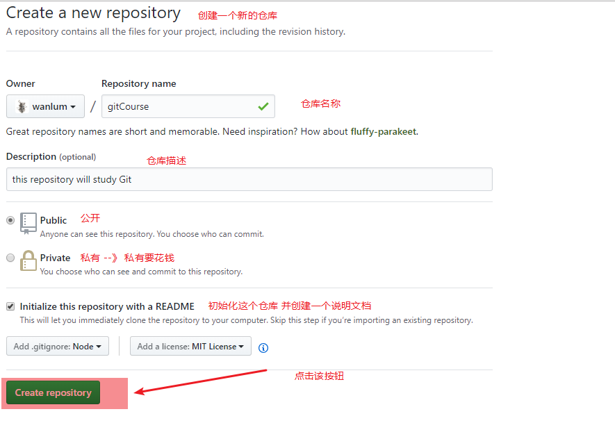

### 第三步： 找到创建好的仓库并找到克隆地址

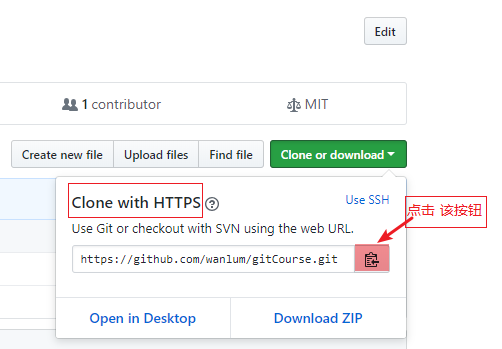

### 第四步: 把新建好的仓库克隆到本地

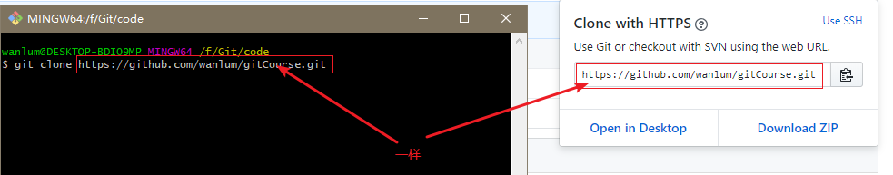

### 第五步: 完成

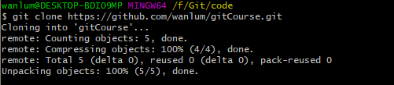

## 知识点六：Git中的四个区


### Remote

远程 仓库（remote）它通常是位于一个远程服务器上的，比如在互联网上或在你的局域网络上。没有任何工作文件与远程仓库相关联：它没有工作目录（workspace），而是完全由 “.git”仓库目录组成的。开发团队使用**远程仓库进行数据共享和交换，远程仓库是协作开发时的一个共同基础**，每个项目成员都可以发布自己的改动，同样也都可以接收到其他成员的改动。

### Repository

本地仓库（ repository）是放置在你的本地计算机中的，它以**一个隐藏文件夹(.git)的形式存储在项目的根目录**（root folder） 中。你是唯一个有权通过提交改动来操作这个仓库的用户。

### Index

暂存区(index 或stage) 它可以让你来确定哪些修改将被打包在下次提交中 ,暂存区 在 本地仓库中

### workspace

工作区(workspace)就是你在电脑里能看到的目录

## 知识点七：本地修改

### 查看文件的状态

```
$ git status
```

### 把当前所有修改添加到下次提交中

```
$ git add .
```

### 提交本地的修改 并写提交注释

```
$ git commit -m '提交注释'
```

## 知识点八：提交历史

### 从最新提交开始显示所有提交记录

```
$ git log
或者
$ git log --pretty=oneline  让历史记录只显示一行
```

### 显示指定文件的所有修改

```
$ git log -p <file>
```

### 谁，在什么时间，修改了文件的什么内容

```
$ git blame <file>
```

## 知识点九：撤销

### 放弃某一个文件的所有本地修改(当文件没有添加到暂存区的时候)

```
$ git checkout HEAD <file>
```

### 放弃工作目录下的所有修改(当文件添加到暂存区之后的时候)

```
$ git reset --hard HEAD
```

## 知识点十：分支操作

### git的使用流程

​	1.在去公司之后 项目经理 会初始化一个仓库

​	2.项目经理会给你Git地址 你把项目Clone到你自己的电脑上

​	3.写代码：

​		3.1 在哪写代码？(已经在运行的代码(master)  在测试中的代码(validity)   你开发的新功能代码(feature)   改bug的代码(hotfix))

​		3.2 底线就是不能在已经运行发的代码上去做开发或者改

​		3.3 线上的代码 只能通过测试完了去把代码放到运行的代码中

​		3.4 开发的新功能一定要先经过测试

​		3.5 在开发过程中  有的时候需要改bug 不能在开发的新功能的代码上接着改bug

### 显示所有分支

```
$ git branch
```

### 创建新分支

```
$ git branch <new-branch>
```

### 切换分支

```
$ git checkout <branch>
```

### 删除分支

```
$ git branch -d <branch>

如果有一天你删除失败了(没有提交代码的分支)
$ git branch -D <branch>
```

### 将分支合并到当前

```
$git merge <branch>
```

## 知识点十一：多人协作

角色: 两个人:rezy 和jax

1.jax 作为项目经理  创建一个仓库  用来开发项目

2.jax作为项目经理 邀请 rezy来一起协同开发


注意点:  每天早上 打开电脑 先来一次 git pull

​	      在写代码过程中   写一个功能测一个功能  提交一个功能到本地仓库

​	      晚上下班前  把所有的代码 推到远程仓库

## 知识点十二：解决冲突

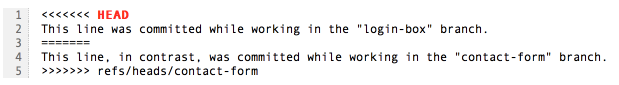

## 知识点十三：忽略特殊文件

先说这么多，欢迎交流！